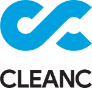

# kitsune

Kitsune is an open-source social media server utilising the ActivityPub protocol.
Utilising the capabilities of ActivityPub, you can interact with people on Mastodon, Misskey, Akkoma, etc.
Due to its decentralised nature, you can self-host Kitsune on your own hardware and still interact with everyone!

Kitsune itself is pretty lightweight and should run even on a Raspberry Pi (even though we haven't tested that yet).

### Chat

Both chat options are bridged. Feel free to join whichever you're more comfortable with:

## ⚠ Disclaimer

This software is far from production-ready. Breaking changes might happen.
So, as long as this disclaimer is here, make sure to double check all the changes before you update your installation.

## Contributing

See [CONTRIBUTING.md](./CONTRIBUTING.md)

## Security

If you found a suspected security vulnerability, please refer to our [security policy](./SECURITY.md) for more details.

## License

For licensing terms, check [LICENSE.md](./LICENSE.md)

### Contribution

Unless you explicitly state otherwise, any contribution intentionally submitted for inclusion in the work by you,
shall be licensed as above, without any additional terms or conditions.

## Sponsors

Woodpecker CI Instance is sponsored by CleanC

